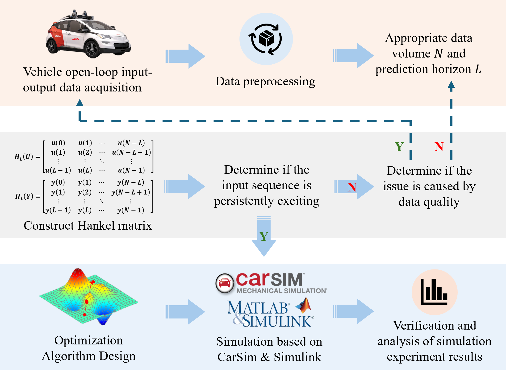

# Data-Driven Model Predictive Control for Autonomous Vehicle Steering

**[Jiarui Zhang](https://tops.tongji.edu.cn/info/1132/1815.htm)**

[Department of Traffic Engineering and Key Laboratory of Road and Traffic Engineering, Ministry of Education, Tongji University](https://tops.tongji.edu.cn/)  

## Abstract

With the development of autonomous driving technology, there are increasing demands for vehicle control, and MPC has become a widely researched topic in both industry and academia. Existing MPC control methods based on vehicle kinematics or dynamics have challenges such as difficult modeling, numerous parameters, strong nonlinearity, and high computational cost. To address these issues, this paper proposes a Data-Driven MPC control method for autonomous vehicle steering. This method avoids the need for complex vehicle system modeling and achieves trajectory tracking with relatively low computational time and small errors. We validate the control effectiveness of our algorithm in specific scenario through CarSim-Simulink simulation and perform comparative analysis with PID and vehicle kinematics MPC, confirming the feasibility and superiority of the proposed algorithm.

## Problem Statement

The development of autonomous vehicle technology relies on efficient and reliable control algorithms. Early control algorithms primarily depended on PID controllers, which often fell short in complex and dynamic driving environments. MPC stands out due to its ability to calculate high-precision control inputs within a limited prediction horizon based on the vehicle model and reference trajectory. However, traditional vehicle models, especially dynamic ones, are challenging to model and calibrate, often leading to significant computational costs. To address this, our proposed Data-Driven MPC for autonomous vehicle steering control leverages the Hankel matrix constructed from offline input-output trajectory data, bypassing the need for complex system models and enhancing prediction accuracy and computational efficiency.

## Methodology
In the article, we give an introduction to Willems' lemma and then point out that Berberich et al. designed a data-driven MPC method based on it. Then, we modify this data-driven MPC so that it can be suitable for steering control of self-driving vehicles, and give the framework of the designed algorithm with a detailed description of the algorithm.

## Experiments

### 1. Data Acquisition 
Since the algorithm is mainly based on data, the source of data directly determines the effectiveness of the algorithm. The open-loop input-output data acquisition of the vehicle in the simulation environment is accomplished by building a scene in CarSim and selecting a D-class vehicle and a driver model that can realize unbiased turning.The scenario and vehicle model are shown in the following figure.

### 2. Algorithm Simulation Experiment 

Based on the collected data, the corresponding Hankel matrices are constructed and used in the data-driven MPC. By choosing the appropriate weight matrix, constraining the upper and lower bounds, and predicting the time domain, the precise control of the vehicle can be accomplished.The following two figures represent the schematic diagram of the two-lane lane changing scenario and the front wheel angle change curve under the control of data-driven MPC, respectively.

     

     

     

In order to verify the superiority of the designed algorithm, we compare it with the more common PID with vehicle kinematics MPC. Simulation experiments are carried out in the same scene with the same speed, and the trajectory tracking effect, tracking error and computational time consumption of the three algorithms are obtained as shown below.

     
       

In addition, in order to compare the differences between the algorithms more clearly, we have intercepted videos of the three algorithms running in CarSim, as shown below. 

<video muted controls> <source src="./src/back.mp4"  type="video/mp4"> </video>

<video muted controls> <source src="./src/lateral.mp4"  type="video/mp4"> </video>

## Contact

If you have any questions, feel free to contact us (zjr0915@tongji.edu.cn).
